# claude-skills

Biblioteca personal de skills de Claude Code de Damián.

## La filosofía: spec-driven development

La fuente de verdad es un **documento escrito**, no un mensaje de chat. Se especifica
qué se quiere, se cierran los huecos, se trocea, se implementa, y al final se revisa
contra lo especificado. Cada skill de este repo ocupa un sitio en ese ciclo.



Dos cosas que hacen que esto funcione y que son las que más se saltan:

- **Lo que aclaras vuelve a la spec.** Aclarar no es una conversación suelta: es
  cerrar un hueco para poder actualizar el documento.
- **La revisión se hace contra la spec**, no contra el gusto de quien revisa. Si el
  código no cumple lo especificado, se vuelve a la spec, no se discute en el PR.

---

## 1 · Planificar

Todo lo anterior a escribir código. Sale una tarea, no una idea.


| Skill | Qué hace |
|---|---|
| `claude-project-setup` | La constitución del proyecto: `CLAUDE.md`, reglas, comandos, agentes. Una vez por repo. |
| `to-spec` | Convierte la idea en una spec: el qué y el porqué. |
| `research` | Investiga contra fuentes primarias y deja el hallazgo escrito y fechado. |
| `to-questionnaire` | Convierte una decisión que no puedes tomar tú solo en un cuestionario para quien sí sabe. |
| `prototype` | Prototipo desechable para responder una duda de diseño. |
| `grill-with-docs` | Interroga el plan y va escribiendo los ADRs y el glosario. La que conviene por defecto. |
| `wayfinder` | Solo si no cabe en una sesión: mapa de tickets de decisión. |
| `to-tickets` | Trocea la spec en tareas de una sentada. |

Cuál usar para aclarar depende de **por qué** está el hueco. El detalle, en
[`docs/1-planificar.md`](docs/1-planificar.md).

---

## 2 · Implementar


| Skill | Qué hace |
|---|---|
| `implement` | Ejecuta una tarea. Una, no varias. |

Detalle en [`docs/2-implementar.md`](docs/2-implementar.md).

---

## 3 · Interfaz

Cuando la tarea toca pantalla, además de `implement` pasa por esta cadena. Dieciséis
skills que se solapan entre sí: el documento existe para saber cuál toca.



| Skill | Qué hace | Origen |
|---|---|---|
| `ingeniero-diseno-web` | Dirige la obra: dirección de arte, design system declarado, puntos de control y crítica con nota. 25 recetas de estilo ancladas. | Garden (ConardLi) |
| `diseno-landing` | Landing de conversión de punta a punta: estructura y textos, más el sistema visual innegociable. | Elaya |
| `sitios-calidad-premio` | Sitios cinematográficos: GSAP, un único motor de scroll suave, Three.js solo con propósito. | Meng To |
| `animar` | Decide en orden si debe animarse, con qué propósito, herramienta, propiedades, curva y duración. | Emil Kowalski |
| `diseno-apple` | Movimiento fluido y físico: muelles, interrumpibilidad, traspaso de velocidad, materiales. | Emil Kowalski |
| `mejor-layout` | Agrupación, alineación, orden de lectura, breakpoints, RTL. | Jakub Krehel |
| `mejor-tipografia` | Escala, interlineado, fuentes variables, wrapping, truncado, puntuación. | Jakub Krehel |
| `mejor-colores` | Rampas, tokens semánticos, contraste medido, modo oscuro. | Jakub Krehel |
| `mejor-accesibilidad` | Nativo antes que ARIA, foco, teclado, áreas de pulsación, formularios. | Jakub Krehel |
| `mejor-ui` | Radios concéntricos, alineación óptica, superficies, transiciones de iconos. | Jakub Krehel |
| `mejor-redaccion` | Voz y tono, botones con verbo, errores que dicen cómo arreglarlo, estados vacíos. | Jakub Krehel |
| `tastemaker` | Que no parezca hecho por IA: color medido de píxeles, paletas generadas, rotación de estructura. | codeswithroh |
| `leyes-de-percepcion` | Gestalt en interfaz: proximidad, similitud, figura-fondo, Von Restorff, jerarquía. | Owl-Listener |
| `leyes-de-retencion` | Por qué se abandona un flujo: Hick, Fitts, Miller, Jakob, Doherty, Zeigarnik, pico-final, Tesler. | Owl-Listener |
| `vocabulario-animacion` | Glosario inverso: convierte "eso que rebota al abrirse" en el término exacto. | Emil Kowalski |
| `video-a-superprompt` | Convierte un vídeo de referencia en un prompt de recreación detallado. | Meng To |

Están traducidas al español. Los ficheros de `references/` y los `scripts/` se
conservan en inglés a propósito, porque los propios `SKILL.md` los citan por ruta.

Detalle y atajos en [`docs/3-interfaz.md`](docs/3-interfaz.md).

---

## 4 · Revisar y cerrar



| Skill | Qué hace |
|---|---|
| `code-review` | Dos ejes en paralelo: Estándares y Spec. |
| `revision-de-cambios` | Revisa el cambio, lee las líneas eliminadas y clasifica cada hallazgo. Solo si tocó interfaz. |
| `revision-interfaz` | Orquesta las seis `mejor-*` en un único informe con veredicto. Solo si tocó interfaz. |
| `handoff` | Compacta la sesión en un documento de traspaso. |

Detalle en [`docs/4-revisar-y-cerrar.md`](docs/4-revisar-y-cerrar.md).

---

## 9 · Otras

Lo que no encaja en el ciclo. Detalle en [`docs/9-otras.md`](docs/9-otras.md).

| Skill | Qué hace |
|---|---|
| `teach` | Explicación didáctica. |
| `muscle-memory` | Gimnasio de katas de Python. |
| `wait-what` | Freno de mano: para y pide que se replantee. |
| `writing-for-agents` | Cómo escribir documentos que consume un agente. La meta-skill. |

`grilling`, `grill-me` y `domain-modeling` están instaladas pero no hace falta
invocarlas: van dentro de `grill-with-docs`.

---

## Instalación

```bash
git clone https://github.com/damiangilgonzalez1995/claude-skills.git
cd claude-skills
python instalar.py
```

> **Por qué hace falta un instalador y no basta con clonar en `~/.claude/skills`**
> Claude Code descubre las skills personales en `~/.claude/skills/<nombre>/SKILL.md`,
> **a un solo nivel**. Una skill dentro de una subcarpeta de categoría no se
> descubre: al invocarla responde `Unknown skill` (comprobado, no supuesto).
>
> Por eso el repo va organizado en carpetas y el instalador lo **aplana** al copiarlo:
> `3-interfaz/animar/` acaba en `~/.claude/skills/animar/`.
>
> Consecuencia: `~/.claude/skills/` es **salida generada**, no fuente de verdad. Edita
> siempre aquí y vuelve a instalar. Lo que edites allí se pierde.

`python instalar.py --dry-run` dice qué haría sin tocar nada.
`--limpiar` borra además del destino lo que ya no esté en el repo.

Para un proyecto concreto, copia la carpeta de la skill a su `.claude/skills/` y
commitea. Para claude.ai hay que subirlas como `.zip`, una a una.
