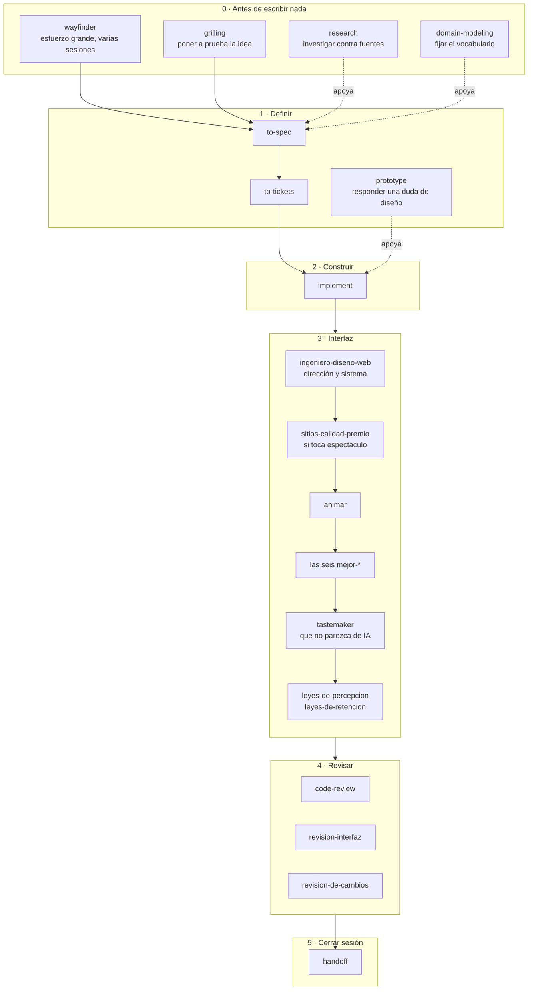

# claude-skills

Biblioteca personal de skills de Claude Code de Damián.

## Estructura

Las skills están agrupadas por la fase del trabajo en la que se usan:

```
0-antes-de-empezar/   wayfinder, grilling, grill-with-docs, grill-me,
                      research, domain-modeling
1-definir/            to-spec, to-tickets, prototype
2-construir/          implement
3-interfaz/           ingeniero-diseno-web, diseno-landing, sitios-calidad-premio,
                      animar, diseno-apple, las seis mejor-*, tastemaker,
                      leyes-de-percepcion, leyes-de-retencion,
                      vocabulario-animacion, video-a-superprompt
4-revisar/            code-review, revision-interfaz, revision-de-cambios
5-cerrar-sesion/      handoff
9-otras/              teach, muscle-memory, claude-project-setup,
                      writing-for-agents, wait-what, to-questionnaire
docs/                 una guía por fase
instalar.py           copia las skills a ~/.claude/skills
```

## Instalación

```bash
git clone https://github.com/damiangilgonzalez1995/claude-skills.git
cd claude-skills
python instalar.py
```

> **Por qué hace falta un instalador y no basta con clonar en `~/.claude/skills`**
> Claude Code descubre las skills personales en `~/.claude/skills/<nombre>/SKILL.md`,
> **a un solo nivel**. Una skill dentro de una subcarpeta de categoría no se
> descubre: al invocarla responde `Unknown skill` (comprobado, no supuesto).
>
> Por eso el repo va organizado en carpetas y el instalador lo **aplana** al
> copiarlo: `3-interfaz/animar/` acaba en `~/.claude/skills/animar/`.
>
> Consecuencia: `~/.claude/skills/` es **salida generada**, no fuente de verdad.
> Edita siempre aquí y vuelve a instalar. Lo que edites allí se pierde en la
> siguiente instalación.

`python instalar.py --dry-run` dice qué haría sin tocar nada.
`--limpiar` borra además del destino las skills que ya no estén en el repo.

---

## El flujo

De la idea al código, en orden. Cada fase tiene su documento con el detalle.



| Fase | Skills | Documento |
|---|---|---|
| **0 · Antes de escribir nada** | `wayfinder` `grilling` `grill-with-docs` `grill-me` `research` `domain-modeling` | [`docs/00-antes-de-empezar.md`](docs/00-antes-de-empezar.md) |
| **1 · Definir** | `to-spec` `to-tickets` `prototype` | [`docs/01-definir.md`](docs/01-definir.md) |
| **2 · Construir** | `implement` | [`docs/02-construir.md`](docs/02-construir.md) |
| **3 · Interfaz** | `ingeniero-diseno-web` `diseno-landing` `sitios-calidad-premio` `animar` `diseno-apple` las seis `mejor-*` `tastemaker` `leyes-de-percepcion` `leyes-de-retencion` `vocabulario-animacion` `video-a-superprompt` | [`docs/03-interfaz.md`](docs/03-interfaz.md) |
| **4 · Revisar** | `code-review` `revision-interfaz` `revision-de-cambios` | [`docs/04-revisar.md`](docs/04-revisar.md) |
| **5 · Cerrar sesión** | `handoff` | [`docs/05-cerrar-sesion.md`](docs/05-cerrar-sesion.md) |
| **Otras** | `teach` `muscle-memory` `claude-project-setup` `writing-for-agents` `wait-what` `to-questionnaire` | [`docs/99-sueltas.md`](docs/99-sueltas.md) |

**La regla corta:** decide **qué** antes de **cómo se ve**, y **cómo se ve** antes de
**cómo se mueve**. Revisar va al final, siempre.

---

## Las tres del principio, que son las que más se saltan

| Skill | Cuándo | Qué te ahorra |
|---|---|---|
| `wayfinder` | El trabajo no cabe en una sesión | Que a la tercera sesión ya nadie sepa qué falta |
| `grilling` | Tienes un plan y te gusta demasiado | Construir tres días la cosa equivocada |
| `to-spec` + `to-tickets` | Antes de tocar código | Un PR de cuarenta ficheros que nadie puede revisar |

---

## Skills de ingeniería

| Skill | Qué hace |
|---|---|
| `wayfinder` | Planifica un esfuerzo enorme (más de una sesión) como un mapa de tickets de decisión que se resuelven de uno en uno. Solo `/wayfinder`. |
| `grilling` | Interroga sin tregua un plan, decisión o idea. |
| `grill-with-docs` | Grilling apoyado en documentación. |
| `research` | Investiga contra fuentes primarias y deja los hallazgos como Markdown en el repo. |
| `domain-modeling` | Construye y afina el modelo de dominio y el lenguaje ubicuo. |
| `to-spec` | Convierte una idea o petición en una spec. |
| `to-tickets` | Descompone una spec en tickets accionables. |
| `prototype` | Prototipo desechable para responder una pregunta de diseño. |
| `implement` | Ejecuta la implementación de un ticket o plan. |
| `code-review` | Revisa cambios desde un punto fijo en dos ejes: Estándares y Spec, en subagentes paralelos. |
| `handoff` | Compacta la conversación en un documento de traspaso. |
| `claude-project-setup` | Inicializa y configura un repo para Claude Code. |
| `teach` | Explicación didáctica. |
| `muscle-memory` | Gimnasio de katas de práctica en Python. |

## Skills de diseño

Portadas y traducidas al español desde repos públicos. Los `SKILL.md` están en
español; los ficheros de `references/` y los `scripts/` se conservan en inglés a
propósito, porque los propios `SKILL.md` los citan por ruta.

| Skill | Qué hace | Origen |
|---|---|---|
| `ingeniero-diseno-web` | Dirige la obra: dirección de arte, design system declarado, puntos de control y crítica con nota. 25 recetas de estilo ancladas. | Garden (ConardLi) |
| `diseno-landing` | Landing de conversión de punta a punta: estructura y textos (Parte A) más el sistema visual innegociable (Parte B). | Elaya |
| `sitios-calidad-premio` | Sitios cinematográficos: GSAP, un único motor de scroll suave, Three.js solo con propósito, assets honestos. | Meng To |
| `animar` | Construye una animación decidiendo en orden: si debe animarse, con qué propósito, herramienta, propiedades, curva y duración. | Emil Kowalski |
| `diseno-apple` | Movimiento fluido y físico: muelles, interrumpibilidad, traspaso de velocidad, materiales, tipografía óptica. | Emil Kowalski |
| `mejor-layout` | Agrupación, alineación, orden de lectura, breakpoints, crecimiento de textos traducidos, RTL. | Jakub Krehel |
| `mejor-tipografia` | Escala, interlineado, fuentes variables, OpenType, wrapping, truncado, puntuación. | Jakub Krehel |
| `mejor-colores` | Rampas, tokens semánticos, contraste medido, modo oscuro, interpolación de degradados. | Jakub Krehel |
| `mejor-accesibilidad` | Nativo antes que ARIA, foco, teclado, áreas de pulsación, formularios, regiones vivas. | Jakub Krehel |
| `mejor-ui` | Radios concéntricos, alineación óptica, superficies, transiciones de iconos, escala al pulsar. | Jakub Krehel |
| `mejor-redaccion` | Voz y tono, botones con verbo, errores que dicen cómo arreglarlo, estados vacíos. | Jakub Krehel |
| `tastemaker` | Que no parezca hecho por IA: color medido de píxeles reales, paletas generadas, rotación de estructura, memoria de gusto. | codeswithroh |
| `leyes-de-percepcion` | Gestalt en interfaz: proximidad, similitud, región común, cierre, continuidad, figura-fondo, Von Restorff, jerarquía. | Owl-Listener |
| `leyes-de-retencion` | Por qué se abandona un flujo: Hick, Fitts, Miller, Jakob, Doherty, Zeigarnik, posición serial, pico-final, Tesler. | Owl-Listener |
| `revision-interfaz` | Orquesta las seis `mejor-*` en una revisión consolidada con severidad y veredicto. | Jakub Krehel |
| `revision-de-cambios` | Revisa un cambio (rama, PR, rango), lee las líneas eliminadas y clasifica cada hallazgo. | Jakub Krehel |
| `vocabulario-animacion` | Glosario inverso: convierte "eso que rebota al abrirse" en el término exacto. | Emil Kowalski |
| `video-a-superprompt` | Convierte un vídeo de referencia en un prompt de recreación detallado. | Meng To |

Cuál usar de las que se solapan, en [`docs/03-interfaz.md`](docs/03-interfaz.md).

---

## Otros destinos

Para un proyecto concreto, copia la carpeta de la skill a su `.claude/skills/` y
commitea: ahí sí viaja con el repo y la ven las sesiones en la nube.

Para claude.ai hay que subirlas como `.zip`, una a una.
