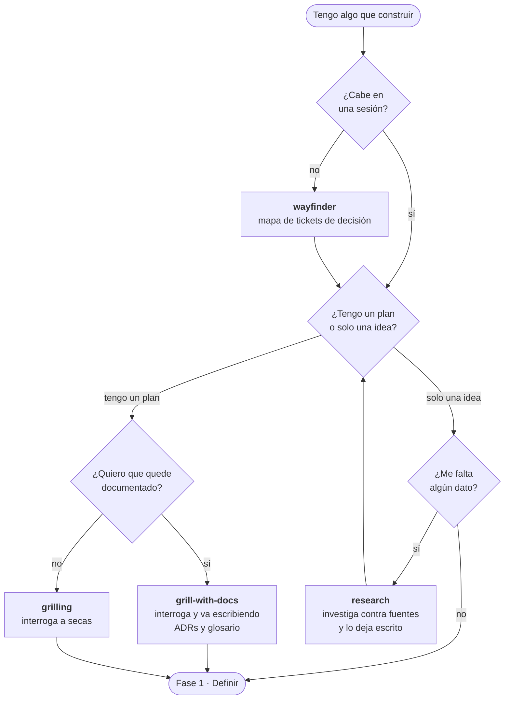

# Fase 0 · Antes de empezar

La fase que más se salta y la que más caro sale saltarse. Aquí no se produce código:
se produce **certeza sobre qué hay que construir**.

Señal de que te la has saltado: a mitad de la implementación aparece un requisito que
cambia el diseño entero.



---

## `wayfinder`

**Cuándo.** El trabajo no cabe en una sesión: varios días, varias personas, o algo
que atraviesa media aplicación.

**Qué hace.** Convierte el esfuerzo en un mapa de tickets de **decisión**, no de
tareas. Cada ticket es una pregunta que hay que cerrar, y se resuelven de uno en uno.
El tracker son GitHub Issues.

**Por qué importa.** Sin esto, a la tercera sesión nadie sabe qué queda pendiente ni
por qué se decidió lo que se decidió. El mapa sobrevive a que se acabe el contexto.

**Cómo se invoca.** Solo con `/wayfinder`. No se auto-invoca a propósito: es una
decisión tuya, no del modelo.

```
/wayfinder

Quiero rehacer el sistema de notificaciones de la aplicación.
```

---

## `grilling`

**Cuándo.** Tienes un plan y te gusta demasiado. O una decisión que llevas
defendiendo un rato sin que nadie la haya atacado en serio.

**Qué hace.** Te interroga sin tregua. No busca ayudarte: busca los agujeros.

**Por qué importa.** Es más barato que se caiga el plan aquí que después de tres días
de implementación.

```
/grilling

Voy a migrar el estado del frontend a un store global. Ponme a prueba.
```

---

## `grill-with-docs`

**Cuándo.** Igual que `grilling`, pero cuando quieres que del interrogatorio salga
documentación y no solo una conversación.

**Qué hace.** Lanza `grilling` apoyándose en `domain-modeling`: mientras te interroga
va escribiendo los ADRs y el glosario del proyecto.

**Por qué es la que deberías usar casi siempre.** Una sesión de `grilling` a secas
resuelve el plan y se evapora. Esta deja el porqué escrito donde alguien lo va a
encontrar dentro de seis meses.

```
/grill-with-docs

En ATI, "incidencia", "parte" y "OT" se usan mezclados y vamos a tocar el modelo.
```

> `domain-modeling` y `grill-me` están en el repo pero no hace falta invocarlos a
> mano: `grill-with-docs` ya usa el primero, y el segundo es solo un atajo a
> `grilling` sin argumentos.

---

## `research`

**Cuándo.** Necesitas hechos, no opiniones. Cómo funciona de verdad una API, qué dice
la especificación, qué cambió en una versión.

**Qué hace.** Investiga contra fuentes primarias de alta confianza y deja los
hallazgos como un fichero Markdown en el repo. Puede correr en segundo plano mientras
tú sigues con otra cosa.

**Por qué importa.** El hallazgo queda escrito y fechado. La próxima vez que surja la
duda, la respuesta ya está.

```
/research

Cómo se comporta el rate limiting de la API de Supabase cuando el cliente
usa el pooler en vez de la conexión directa?
```

---

## Resumen

| Tu situación | Skill |
|---|---|
| Esto es enorme y no sé por dónde empezar | `wayfinder` |
| Tengo un plan y quiero que lo destroces | `grilling` |
| Igual, pero quiero que quede documentado | `grill-with-docs` |
| Me falta un dato y no me lo quiero inventar | `research` |

Lo normal en algo grande: `wayfinder` primero, y luego `grill-with-docs` o `research`
dentro de cada ticket del mapa.

**Siguiente:** [01 · Definir](01-definir.md)
