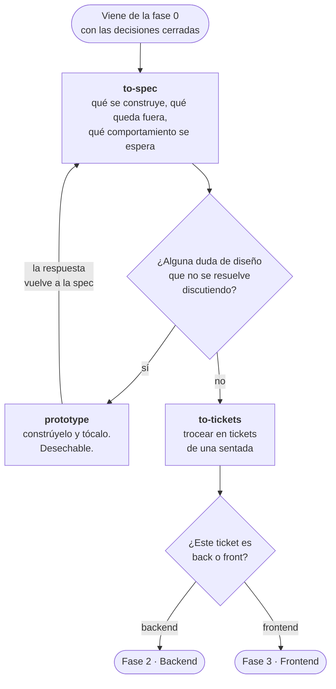

# Fase 1 · Definir

Convertir lo decidido en algo que se pueda implementar sin volver a decidir. Es la
parte de *spec-driven development*: primero el documento, luego el código.

La cadena es corta y no tiene atajos.



---

## `to-spec`

**Cuándo.** Ya sabes qué quieres construir y por qué. Antes de tocar código.

**Qué hace.** Convierte la idea o la petición en una spec: qué se construye, qué
queda fuera, qué comportamiento se espera y qué decisiones ya están cerradas.

**Por qué importa.** Una spec escrita es lo que permite revisar después si lo
construido es lo pedido. Sin ella, "está terminado" es una opinión.

```
/to-spec

Los técnicos tienen que poder anotar la solución desde el móvil, con foto,
y que eso cierre la incidencia.
```

**Sale de aquí:** un fichero de spec en el repo, no un mensaje en el chat.

---

## `prototype`

**Cuándo.** Hay una duda de diseño que no se resuelve discutiendo. "¿Este modelo de
estados se siente bien?" "¿Cómo debería verse esta pantalla?"

**Qué hace.** Construye un prototipo **desechable** para responder esa pregunta
concreta. No es el código final y no se queda.

**Por qué va aquí y no en la fase de construir.** Porque su respuesta cambia la spec.
Prototipar después de haber escrito la spec entera es prototipar para confirmar lo
que ya decidiste.

```
/prototype

Necesito ver si el selector de estado de incidencia funciona mejor como
desplegable o como pastillas en línea.
```

**Ojo:** es desechable de verdad. Si el prototipo acaba en producción, el prototipo
no era un prototipo.

---

## `to-tickets`

**Cuándo.** Con la spec cerrada. Siempre.

**Qué hace.** Descompone la spec en tickets accionables, cada uno lo bastante pequeño
como para resolverse de una sentada y revisarse de un vistazo.

**Por qué importa.** Es lo que evita el PR de cuarenta ficheros que nadie puede
revisar de verdad. Un ticket, una rama, un PR.

```
/to-tickets

Descompón la spec de anotar solución desde móvil.
```

---

## Trocea separando back y front

Un ticket que toca las dos mitades se revisa mal: mezcla criterios de correctitud con
criterios de interfaz, y acaba en un PR que nadie sabe si aprobar.

Si un ticket necesita endpoint **y** pantalla, pártelo en dos: el back primero, con
el contrato de la API cerrado, y el front después contra ese contrato.

**Anterior:** [00 · Antes de empezar](00-antes-de-empezar.md) ·
**Siguiente:** [02 · Backend](02-backend.md) o [03 · Frontend](03-frontend.md)
