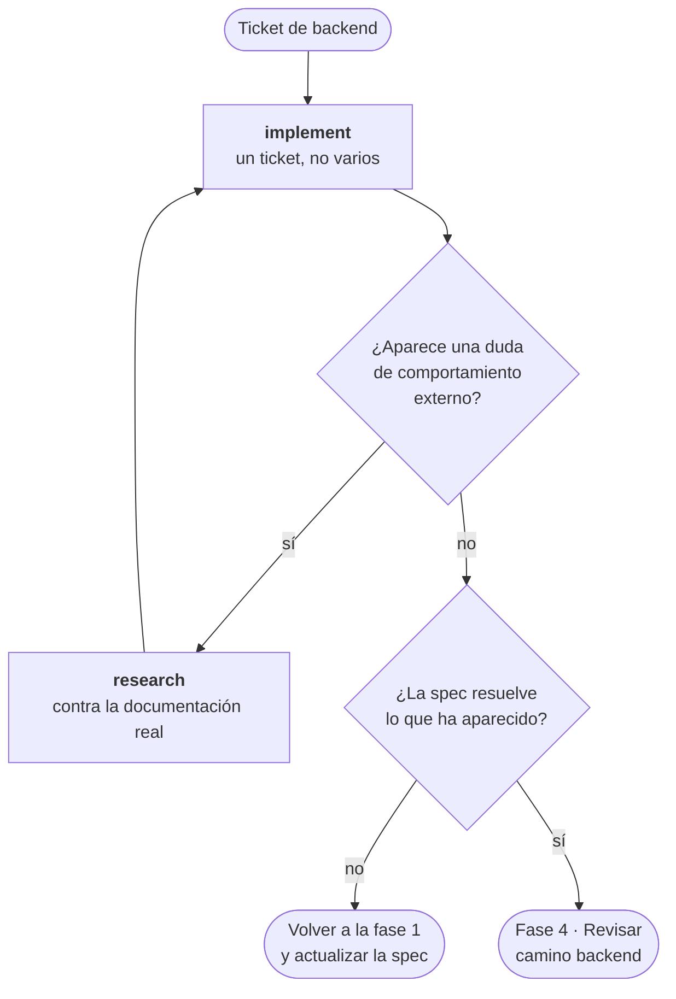

# Fase 2 · Backend

La parte que no se ve. Tiene menos skills que el frontend a propósito: aquí el
trabajo ya está decidido en la spec, y lo que queda es ejecutarlo bien.

Si en esta fase te encuentras tomando decisiones de producto, es que la fase 1 se
quedó a medias. Vuelve.



---

## `implement`

**Cuándo.** Tienes un ticket de `to-tickets` o un plan escrito.

**Qué hace.** Ejecuta la implementación de ese ticket. Uno, no varios.

**Por qué importa.** Mantiene el trabajo acotado a lo que la spec dice, y el diff
revisable.

```
/implement

Ticket #42.
```

---

## Un ticket, una sesión

La tentación es encadenar tickets en la misma conversación. Aguanta lo que aguanta:
según crece el contexto, el modelo empieza a mezclar decisiones de un ticket con las
del siguiente.

Si vas a encadenar, cierra con [`handoff`](05-cerrar-sesion.md) y abre sesión nueva.

---

## Cuando aparece una duda a mitad

Dos casos, y se resuelven distinto:

| Qué ha aparecido | Qué hacer |
|---|---|
| No sé cómo se comporta una herramienta externa | `research`, y sigues |
| La spec no contempla este caso | Para. Vuelve a la fase 1 y actualiza la spec |

El segundo es el que se hace mal: se decide sobre la marcha, no queda escrito en
ningún sitio, y en la revisión nadie puede comprobar si era lo pedido.

---

## El contrato de la API es la frontera

Si este ticket va a alimentar una pantalla, el contrato de la API es lo que el
frontend va a dar por hecho. Déjalo cerrado y escrito antes de pasar a la fase 3:
cambiarlo después significa rehacer las dos mitades.

**Anterior:** [01 · Definir](01-definir.md) ·
**Siguiente:** [04 · Revisar](04-revisar.md)
