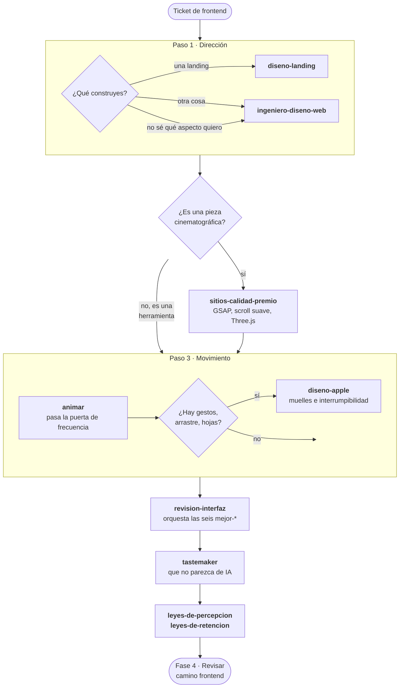

# Fase 3 · Frontend

Dieciséis skills, y ese es el problema: se solapan. Este documento existe para que no
tengas que leerlas todas para saber cuál toca.

**El orden, en una línea:** qué dice → cómo se ve → cómo se mueve → pulido →
originalidad → psicología.

---

## Paso 1 · Dirección y estructura

Aquí se decide **qué es** la pantalla. Elige **una** de estas dos, no las dos:

| Construyes | Skill | Por qué esa |
|---|---|---|
| Una landing | `diseno-landing` | Es la única que habla de negocio: una oferta, objeciones, FAQ, reversión de riesgo, SEO. Su Parte B ya trae las reglas visuales, así que no necesitas nada más. |
| Cualquier otra cosa: dashboard, prototipo, presentación, visualización | `ingeniero-diseno-web` | Dirección de arte, design system declarado, 25 recetas ancladas y puntos de control que te frenan a confirmar. |

**Para una landing no uses `ingeniero-diseno-web`.** `diseno-landing` ya la cubre
entera. Se solapan porque son de autores distintos que resolvieron lo mismo a su
manera.

**Si no sabes qué aspecto quieres:** `ingeniero-diseno-web` tiene un asesor de
dirección que te propone tres escuelas distintas con referencias reales. Eliges, y
vuelves a la que tocaba.

---

## Paso 2 · Espectáculo, solo si toca

### `sitios-calidad-premio`

**Cuándo.** Piezas cinematográficas: lanzamiento de producto, portafolio, algo que
tiene que impresionar. GSAP, scroll suave, Three.js.

**Cuándo NO.** Un dashboard, una herramienta interna, cualquier cosa que se use a
diario. Ahí el espectáculo es un coste que se paga en cada uso.

Es la más cara de las dieciséis en esfuerzo y en rendimiento. Sáltatela sin
remordimiento.

---

## Paso 3 · Movimiento

### `animar`

**Cuándo.** Cualquier cosa que se mueva.

**Qué la hace distinta.** Antes de escribir código pasa una **puerta de frecuencia**:
si el usuario va a ver eso cien veces al día, la respuesta correcta es no animarlo.
Es la única skill diseñada para producir a veces cero líneas de código.

### `diseno-apple`

**Cuándo.** Gestos, arrastre, hojas deslizantes, cosas que se agarran con el dedo.

**Qué añade sobre `animar`.** Muelles con física real, interrumpibilidad y traspaso
de velocidad. Es lo que separa "correcto" de "fluido". Para un fundido o un hover no
la necesitas.

### `vocabulario-animacion`

No construye nada. Le describes un efecto ("eso que rebota al abrirse") y te da el
término exacto para poder pedirlo bien.

### `video-a-superprompt`

Le pasas la grabación de una web que te gusta y te devuelve un prompt de recreación
detallado: anatomía sección a sección, sistema de movimiento, mapa de assets y
comportamiento en móvil y con movimiento reducido.

**Necesita `ffmpeg`** en el PATH: `winget install Gyan.FFmpeg`.

---

## Paso 4 · Pulido, las seis de dominio

Las `mejor-*` son reglas concretas con valores exactos. Cada una manda sobre su
terreno y no se pisan:

| Skill | Su terreno |
|---|---|
| `mejor-layout` | Agrupación, alineación, orden de lectura, breakpoints, RTL |
| `mejor-tipografia` | Escala, interlineado, wrapping, truncado, puntuación |
| `mejor-colores` | Rampas, tokens, contraste medido, modo oscuro |
| `mejor-accesibilidad` | Foco, teclado, ARIA, áreas de pulsación, formularios |
| `mejor-ui` | Radios, alineación óptica, superficies, iconos, escala al pulsar |
| `mejor-redaccion` | Textos de botón, errores, estados vacíos, voz y tono |

**No las invoques a mano una a una.** Usa `revision-interfaz`, que las orquesta en
orden y consolida un único informe. Invoca una suelta solo cuando tengas una duda
puntual de su terreno ("qué espaciado le falta a esto").

---

## Paso 5 · Que no parezca de IA

### `tastemaker`

Va después del pulido porque necesita que exista algo que auditar, y **antes** que
las leyes porque cambia estructura, no solo detalles.

Ataca lo que hace que todas las webs generadas se parezcan: mide el color de píxeles
reales, genera la paleta en vez de elegirla de una lista, y rota la forma de página
contra lo que construiste la vez anterior.

Tiene un **modo auditar** que no toca nada: te dice por qué una pantalla parece
generada.

**Necesita Python.** Sin sus scripts pierde justo lo que la hace distinta.

---

## Paso 6 · Psicología

### `leyes-de-percepcion`

Gestalt aplicada: proximidad, similitud, región común, cierre, continuidad,
figura-fondo, Von Restorff, jerarquía. Sirve para **componer** y para **diagnosticar**
por qué una pantalla se siente ruidosa o plana.

Trae un diagnóstico de seis puntos que se pasa en dos minutos, empezando por la
prueba de entrecerrar los ojos.

### `leyes-de-retencion`

Nueve leyes, cada una explicando una clase distinta de abandono. Su tabla de
síntoma → ley es lo más rentable de las dieciséis:

| Síntoma | Ley |
|---|---|
| Se queda parado sin elegir | Hick |
| Falla el objetivo en móvil | Fitts |
| Se pierde a mitad del formulario | Miller |
| No encuentra algo que está a la vista | Jakob |
| Se va durante la espera | Doherty |
| Empieza y no vuelve | Zeigarnik |
| Se salta lo del medio de una lista | Posición serial |
| Lo completa pero lo recuerda mal | Pico-final |
| Todo parece simple y aun así sufre | Tesler |

---

## Atajos según el caso

| Situación | Cadena |
|---|---|
| Landing nueva | `diseno-landing` → `animar` → `revision-interfaz` |
| Dashboard nuevo | `ingeniero-diseno-web` → `revision-interfaz` |
| Pantalla que "parece de IA" | `tastemaker` (auditar) → `leyes-de-percepcion` |
| Un flujo pierde usuarios | `leyes-de-retencion` → `mejor-redaccion` → `mejor-accesibilidad` |
| Solo quiero pulir lo que hay | `revision-interfaz` |

**Anterior:** [01 · Definir](01-definir.md) ·
**Siguiente:** [04 · Revisar](04-revisar.md)
