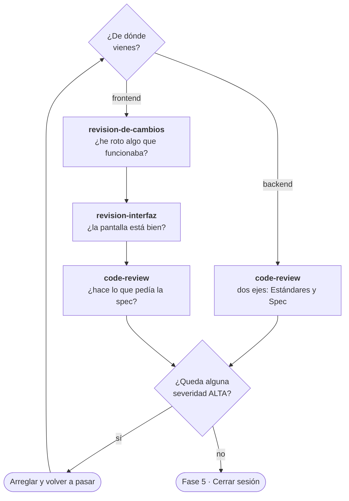

# Fase 4 · Revisar

Tres skills que miran cosas distintas. El camino no es el mismo según vengas del
backend o del frontend.



---

## `code-review` — el camino común

**Qué mira.** El código, en dos ejes independientes que corren en subagentes
paralelos:

- **Estándares** — ¿sigue las convenciones documentadas del repo?
- **Spec** — ¿hace lo que pedía el issue o la spec de origen?

**Por qué los dos ejes.** Un código impecable que resuelve otra cosa pasa cualquier
revisión de estilo. El segundo eje es el que lo caza, y es el que se olvida.

```
/code-review

Desde main.
```

Acepta un punto fijo: un commit, una rama, un tag o un merge-base.

**En backend es la única que necesitas.** En frontend va la última, después de las
dos de interfaz.

---

## `revision-de-cambios` — solo frontend, y va primero

**Qué mira.** El **cambio**, no la pantalla. Resuelve el alcance contra el
merge-base, expande los ficheros tocados a las superficies donde se renderizan, y
clasifica cada hallazgo:

- `Introducido` — lo creó este cambio
- `Regresión` — debilitó algo que antes funcionaba
- `Preexistente` — ya estaba, no es culpa de este cambio

**Por qué esa clasificación importa.** Es la diferencia entre "has roto esto" y "esto
ya estaba roto". Sin ella, tocar un fichero heredado se convierte en una auditoría
completa que nadie pidió.

**Lo que hace y nadie más hace:** leer el lado `-` del diff. Las regresiones son
invisibles mirando solo el estado final.

**Por qué va antes que `revision-interfaz`.** Porque responde a otra pregunta. Esta
dice si empeoraste algo; la otra dice si la pantalla está bien. Si empezaste por la
segunda, te llenas el informe de problemas que ya estaban ahí.

```
/revision-de-cambios pr 482
```

Sin argumentos revisa lo que tengas sin commitear. Es de solo lectura: nunca hace
checkout de nada.

---

## `revision-interfaz` — solo frontend

**Qué mira.** La pantalla. Enruta a las seis `mejor-*` en orden (accesibilidad,
layout, redacción, tipografía, color, acabado), consolida en **una** tabla ordenada
por severidad y emite un veredicto.

**Cuándo.** Cuando el trabajo toca interfaz. Es la forma correcta de usar las seis: a
mano y una a una salen seis informes inconexos.

**Lo que la hace fiable.** Tiene disparadores de escalado que son ALTA a la vista, sin
promediar: un control sin nombre accesible, foco invisible, movimiento que ignora
`prefers-reduced-motion`, contenido recortado a 320px, significado transmitido solo
por color.

```
/revision-interfaz

Revisa la pantalla de reserva.
```

---

## Resumen

| Vienes de | Orden |
|---|---|
| **Backend** | `code-review` |
| **Frontend** | `revision-de-cambios` → `revision-interfaz` → `code-review` |

En frontend el orden no es capricho: primero qué has roto, luego cómo está la
pantalla, y al final si hace lo que pedía la spec.

**Anterior:** [02 · Backend](02-backend.md) o [03 · Frontend](03-frontend.md) ·
**Siguiente:** [05 · Cerrar sesión](05-cerrar-sesion.md)
