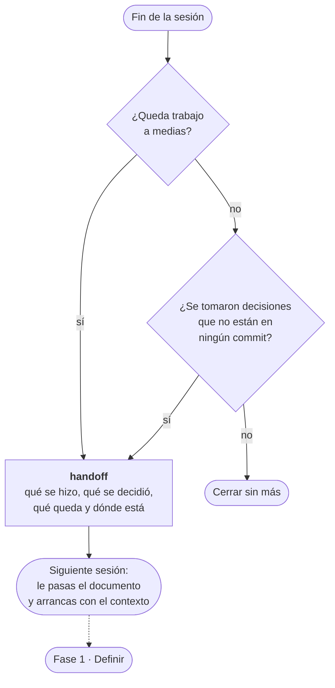

# Fase 5 · Cerrar sesión

Una sola skill, y es la que más rendimiento da por el poco tiempo que cuesta.



---

## `handoff`

**Cuándo.** Al final de una sesión de trabajo. Sobre todo si queda trabajo a medias.

**Qué hace.** Compacta la conversación en un documento de traspaso: qué se hizo, qué
se decidió y por qué, qué queda pendiente y dónde está cada cosa.

**Por qué importa.** Una sesión larga acumula decenas de decisiones pequeñas que no
están en ningún commit. Al abrir la siguiente sesión, ese contexto se ha perdido y se
vuelve a discutir lo mismo, o peor: se deshace sin querer algo que se decidió por un
motivo.

```
/handoff
```

**Cómo se usa el documento.** Al empezar la siguiente sesión, se lo pasas y arrancas
con el mismo contexto sin haber gastado la mitad del presupuesto en reconstruirlo.

---

## Cuándo hacerlo, además del final

- **Antes de encadenar tickets.** Cierra con `handoff`, abre sesión nueva, empieza
  limpio. Mejor que arrastrar el contexto del ticket anterior.
- **Cuando notes que el modelo empieza a mezclar cosas.** Es la señal de que el
  contexto está saturado.
- **Antes de dejar algo a medias más de un día.** Mañana no te acuerdas, y en una
  semana menos.

---

## Lo que no sustituye

`handoff` es contexto de trabajo, no memoria del proyecto. Lo que sea una decisión
duradera va a un ADR o a `domain-modeling`, no a un traspaso que se lee una vez.

**Anterior:** [04 · Revisar](04-revisar.md) ·
**Fuera del flujo:** [99 · Otras](99-otras.md)
