# 1 · Planificar

Todo lo que pasa **antes de escribir código**. Sale un ticket, no una idea.

Sigue el método *spec-driven development*: la fuente de verdad es un documento
escrito, no un mensaje de chat. Las fases de SDD —especificar, aclarar, planificar y
trocear— caen todas dentro de esta carpeta.



---

## `claude-project-setup` — una vez por proyecto

Equivale a la fase **constitution** de SDD: los principios que gobiernan el
proyecto. Inicializa `CLAUDE.md`, reglas, comandos y agentes.

No se repite en cada tarea. Se hace al abrir el repo y se retoca cuando cambian las
convenciones.

---

## `to-spec` — el qué y el porqué

**Cuándo.** Ya sabes qué quieres construir. Antes de tocar código.

**Qué hace.** Convierte la idea en una spec: qué se construye, qué queda fuera, qué
comportamiento se espera y qué decisiones están cerradas.

**Por qué importa.** Una spec escrita es lo que permite revisar después si lo
construido es lo pedido. Sin ella, "está terminado" es una opinión.

```
/to-spec

Los técnicos tienen que poder anotar la solución desde el móvil, con foto,
y que eso cierre la incidencia.
```

**Sale de aquí:** un fichero en el repo, no un mensaje en el chat.

---

## Aclarar: cuatro caminos según qué falte

Es la fase **clarify** de SDD, y la que más se salta. Una spec con huecos produce
código con huecos. Cuál usar depende de **por qué** está el hueco:

| El hueco es… | Skill |
|---|---|
| Un dato que no sé y está documentado en algún sitio | `research` |
| Algo que no puedo saber yo: lo sabe el cliente, el comercial, producto | `to-questionnaire` |
| Una decisión de diseño que no se resuelve discutiendo, hay que verla | `prototype` |
| El plan está entero pero nadie lo ha atacado | `grill-with-docs` |

Las cuatro **vuelven a la spec**. No son fases sueltas: son maneras de cerrar un
hueco para poder actualizar el documento.

### `research`

Investiga contra fuentes primarias y deja el hallazgo como Markdown en el repo,
fechado. La próxima vez que surja la duda, la respuesta ya está.

### `to-questionnaire`

Convierte la decisión en un cuestionario en Markdown para que lo rellene quien sí
sabe. Evita el bloqueo de "esto no lo sé" y su alternativa mala, que es decidirlo tú
y descubrir en la demo que estaba mal.

### `prototype`

Prototipo **desechable** para responder una pregunta concreta de diseño. Si acaba en
producción, no era un prototipo.

### `grill-with-docs`

Interroga el plan sin tregua y **va escribiendo los ADRs y el glosario** mientras lo
hace. Es `grilling` + `domain-modeling`, y es la que conviene usar por defecto: una
sesión de `grilling` a secas resuelve el plan y se evapora.

> `grilling`, `grill-me` y `domain-modeling` están instaladas pero no hace falta
> invocarlas: la primera va dentro de `grill-with-docs`, la segunda es un atajo, y la
> tercera la usa `grill-with-docs`.

---

## `wayfinder` — solo si no cabe en una sesión

Es la fase **plan** de SDD cuando el esfuerzo es grande: varios días, varias personas,
algo que atraviesa media aplicación.

Convierte el trabajo en un mapa de tickets de **decisión**, no de tareas. Cada ticket
es una pregunta que hay que cerrar, y se resuelven de uno en uno. El tracker son
GitHub Issues.

**Va aquí y no al principio.** No puedes mapear decisiones antes de tener la spec:
sin ella no sabes cuáles son.

```
/wayfinder

Quiero rehacer el sistema de notificaciones.
```

---

## `to-tickets` — trocear

Descompone la spec en tickets accionables, cada uno resoluble de una sentada y
revisable de un vistazo. Es lo que evita el PR de cuarenta ficheros.

**Trocea separando back y front.** Un ticket que toca las dos mitades se revisa mal:
mezcla criterios de correctitud con criterios de interfaz. Si necesita endpoint y
pantalla, pártelo: el back primero con el contrato de la API cerrado, el front
después contra ese contrato.

---

**Siguiente:** [2 · Backend](2-backend.md) o [3 · Frontend](3-frontend.md)
