# 2 · Backend

Una sola skill, y es a propósito: aquí el trabajo ya está decidido en la spec y lo
que queda es ejecutarlo.



---

## `implement`

**Cuándo.** Tienes un ticket de `to-tickets`.

**Qué hace.** Ejecuta la implementación de ese ticket. Uno, no varios.

```
/implement

Ticket #42.
```

---

## Un ticket, una sesión

La tentación es encadenar tickets en la misma conversación. Aguanta lo que aguanta:
según crece el contexto, el modelo empieza a mezclar decisiones de un ticket con las
del siguiente.

Si vas a encadenar, cierra con `handoff` y abre sesión nueva.

---

## Cuando aparece algo que la spec no contempla

Dos casos, y se resuelven distinto:

| Qué ha aparecido | Qué hacer |
|---|---|
| No sé cómo se comporta una herramienta externa | `research`, y sigues |
| Es una decisión de producto | **Para.** Vuelve a la spec y actualízala |

El segundo es el que se hace mal: se decide sobre la marcha, no queda escrito, y en
la revisión nadie puede comprobar si era lo pedido.

---

## El contrato de la API es la frontera

Si este ticket alimenta una pantalla, el contrato es lo que el frontend va a dar por
hecho. Déjalo cerrado y escrito antes de pasar a la fase 3: cambiarlo después
significa rehacer las dos mitades.

**Siguiente:** [4 · Revisar y cerrar](4-revisar-y-cerrar.md)
