# 2 · Implementar

Aquí el trabajo ya está decidido en la spec y lo que queda es ejecutarlo. Si la tarea
toca interfaz, pasa además por [la cadena de interfaz](3-interfaz.md).



---

## `implement`

**Cuándo.** Tienes una tarea de `to-tickets`.

**Qué hace.** Ejecuta la implementación de esa tarea. Una, no varias.

```
/implement

Ticket #42.
```

---

## Una tarea, una sesión

La tentación es encadenar tareas en la misma conversación. Aguanta lo que aguanta:
según crece el contexto, el modelo empieza a mezclar decisiones de una tarea con las
de la siguiente.

Si vas a encadenar, cierra con `handoff` y abre sesión nueva.

---

## Cuando aparece algo que la spec no contempla

Dos casos, y se resuelven distinto:

| Qué ha aparecido | Qué hacer |
|---|---|
| No sé cómo se comporta una herramienta externa | `research`, y sigues |
| Es una decisión de producto | **Para.** Vuelve a la spec y actualízala |

El segundo es el que se hace mal: se decide sobre la marcha, no queda escrito, y en
la revisión nadie puede comprobar si era lo pedido.

---

## El contrato de la API es la frontera

Si esta tarea alimenta una pantalla, el contrato es lo que el frontend va a dar por
hecho. Déjalo cerrado y escrito antes de pasar a la interfaz: cambiarlo después
significa rehacer las dos mitades.

**Siguiente:** [3 · Interfaz](3-interfaz.md) si toca pantalla, o [4 · Revisar y cerrar](4-revisar-y-cerrar.md)
